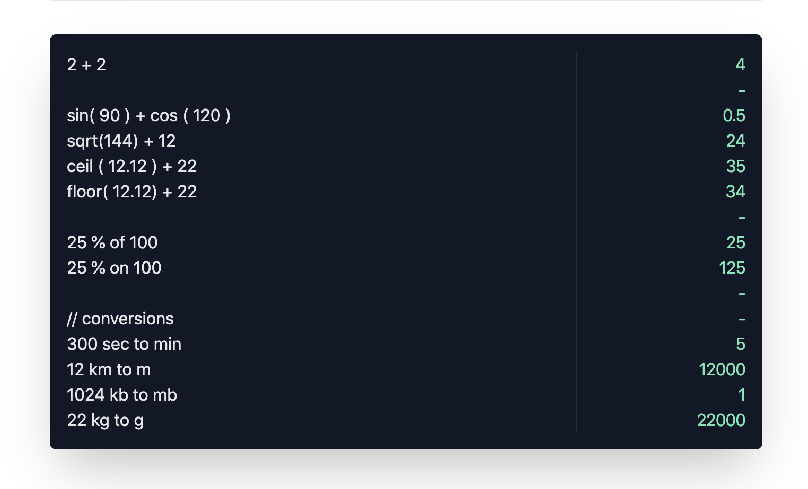

[](https://abhimanyu003.github.io/qubit/)

# qubit

[Website](https://abhimanyu003.github.io/qubit/)

[](https://abhimanyu003.github.io/qubit/)

## Example

Visit [Website](https://abhimanyu003.github.io/qubit/) to try

```
2 + 2

sin( 90 ) + cos ( 120 )
sqrt(144) + 12
ceil ( 12.12 ) + 22
floor( 12.12) + 22

25 % of 100
25 % on 100

// Conversions
1024 kb to mb
22 kg to g
```

## Operations

* add 
* subtract
* multiply
* divide
* power
* modulus
* rightShift
* leftShift
* percentOf
* percentOn 
* sin
* cos
* tan
* sqrt
* cbrt
* round
* ceil
* floor

## Supported Conversions

* Angle
* Area
* Digital Information
* Length
* Mass
* Speed
* Time
* Temperature